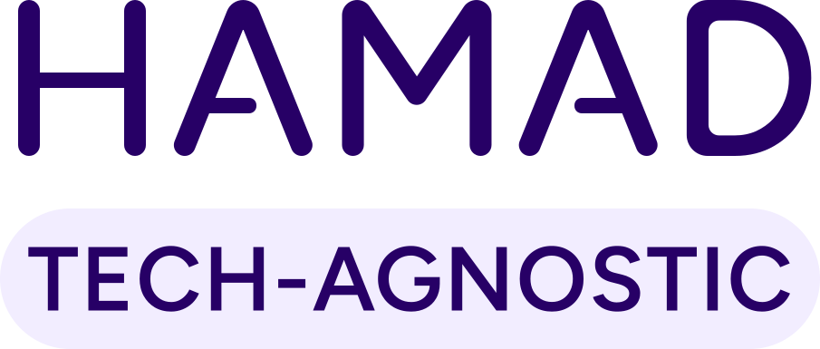

<picture>
  <source media="(prefers-color-scheme: dark)" srcset="assets/hamad-logo-dark.svg">
  
</picture>

### Lead Web Developer &nbsp;·&nbsp; AI Workflows

**Regulated pharma and healthcare platforms** &nbsp;·&nbsp; London, United Kingdom

   

 

## About

I build and lead delivery on content-heavy web platforms for pharmaceutical and healthcare
clients, where a missed compliance detail is a regulatory problem rather than a bug. Most of
that work runs on Drupal and WordPress, and most of it has to satisfy the ABPI Code of
Practice, PMCPA review, GDPR, and WCAG 2.1 AA before it is allowed to ship.

I have been with **Digital Dynamite** since 2019, moving from associate developer to leading
development on our most recent platforms, where I own architecture decisions, run front-end
code review, manage CI/CD, and mentor the junior developers on the team.

Alongside that I served as a volunteer **Drupal engineer with UNICEF** through the UN
Volunteers programme, contributing to Laaha and eRefer, two platforms built to reach women
and girls in under-resourced communities.

More recently I have been building with the Claude API, the Model Context Protocol, and agent
tooling, and writing about what actually survives contact with a regulated environment.
More at **[hamadhere.de](https://hamadhere.de)**.

 

## Certifications

<b>WEB &amp; DRUPAL</b>

 

<b>Acquia Certified Site Builder</b> &nbsp;·&nbsp; Drupal 8 (2019) and Drupal 9 (2021)

<a href="https://certification.acquia.com/person/certified/hamad-khan">Verify on the Acquia registry</a>

&nbsp;

<b>AI &amp; AGENTS</b>

  

  

Six certificates from <b>Anthropic</b> &nbsp;·&nbsp; every badge links to its verification page

&nbsp;

<b>PHARMA &amp; LIFE SCIENCES</b>

  

The Association of the British Pharmaceutical Industry (2026) &nbsp;·&nbsp; Veeva Systems (2021)

&nbsp;

<b>SUSTAINABLE TECHNOLOGY</b>

 

The Linux Foundation &nbsp;·&nbsp; United Nations System Staff College &nbsp;·&nbsp; 2024

 

## Stack

<b>BACKEND &amp; CMS</b>

     

<b>FRONT-END</b>

      

<b>PLATFORM &amp; TOOLING</b>

   

<b>COMMUNICATION &amp; FILE SHARING</b>

 

 

## Development Metrics

 

Seven years full time with Digital Dynamite, counted at 40 hours a week. Figures above are my own estimate. 
Everything below this line is measured automatically by WakaTime.

<!--START_SECTION:waka-->

Populated automatically from WakaTime once the <b>Development Metrics</b> workflow runs. 
Code Time and AI Code Time cover all tracked history. Commit rhythm covers every year on GitHub. 
The language, editor and OS split is a rolling seven days.

<!--END_SECTION:waka-->

 

## GitHub Activity

 

 

 

Deep down in Pharma, Healthcare, and Regulated Industries. 
Currently heads-down building tools that save time in day-to-day development. 
<b><a href="https://hamadhere.de">hamadhere.de</a></b>

